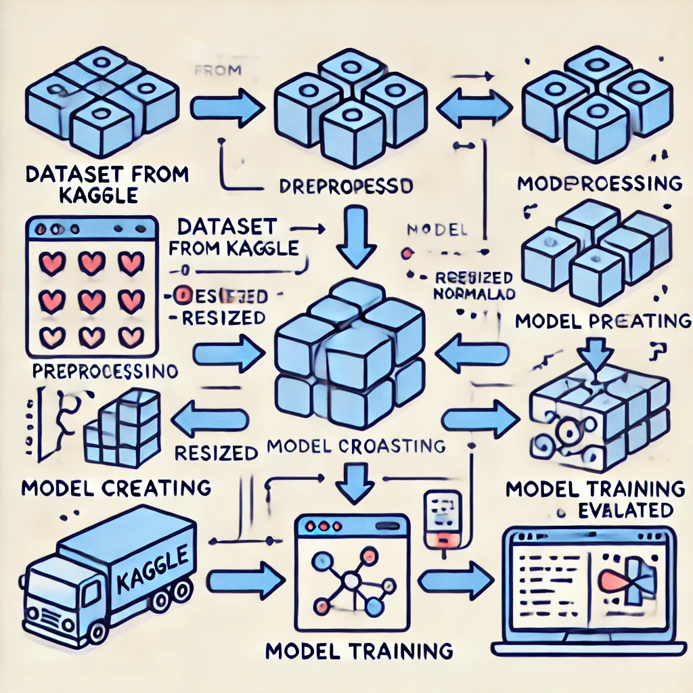

# Arquitetura da Solução

Pré-requisitos: <a href="2-Especificação do Projeto.md"> Especificação do projeto</a>

Definição de como o software é estruturado em termos dos componentes que fazem parte da solução e do ambiente de hospedagem da aplicação.

## Diagrama de Componentes

O diagrama a seguir ilustra a arquitetura da solução, descrevendo os componentes principais e seus relacionamentos. A solução implementada envolve o treinamento e a aplicação de um modelo de aprendizado de máquina para reconhecimento de plantas em imagens, com o uso de técnicas de Visão Computacional.

Figura XX - Arquitetura da Solução

A solução implementada conta com os seguintes módulos:

- **Coleta de Dados**: Responsável pela coleta de imagens de plantas de diversas fontes, como redes sociais, Google, Kaggle e outros datasets especializados.
  - **Fontes de Dados**: As imagens de plantas são capturadas a partir de diferentes fontes, incluindo plataformas como redes sociais e sites especializados em datasets de plantas.
  - **Armazenamento e Pré-processamento**: As imagens são processadas e armazenadas em um formato adequado para treinamento do modelo.
  
- **Modelo de Reconhecimento de Plantas**: O core da solução, onde o modelo de aprendizado de máquina é treinado para reconhecer diferentes espécies de plantas a partir das imagens.
  - **Pré-processamento**: Normalização e transformação das imagens para um formato padrão antes de alimentar o modelo.
  - **Treinamento de Modelo**: O modelo é treinado utilizando redes neurais convolucionais (CNNs), com uma arquitetura que inclui camadas de convolução e pooling para extração de características das imagens.
  - **Avaliação do Modelo**: O modelo é avaliado com um conjunto de dados de teste para verificar a precisão e confiabilidade das previsões.

> **Links Úteis**:
>
> - [Kaggle](https://www.kaggle.com/)
> - [TensorFlow](https://www.tensorflow.org/)
> - [Google Cloud Platform](https://cloud.google.com/)

## Tecnologias Utilizadas

A solução é composta por um conjunto de tecnologias e ferramentas que permitem a coleta de dados, treinamento do modelo de aprendizado de máquina. As principais tecnologias incluem:

- **Python**: Linguagem de programação usada para implementar o modelo e os scripts de pré-processamento e treinamento.
- **TensorFlow/Keras**: Frameworks de aprendizado de máquina utilizados para construir e treinar o modelo de reconhecimento de plantas.
- **OpenCV**: Biblioteca de visão computacional para o pré-processamento das imagens, como redimensionamento e conversão de formatos.

